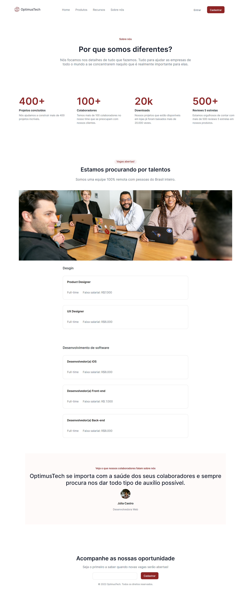

# Resolução do #7daysOfCode da Alura
    Um desafio de codigo desenvolvido em HTML 
    e CSS, onde eu fui montando uma landing page de acordo com o design do Figma tentando
    deixa o mais proximo possivel do original

    E esse foi meu resultado! :)

    Ainda tenho muito o que melhorar mas consegui teminar tudo.

## Print do resultado

